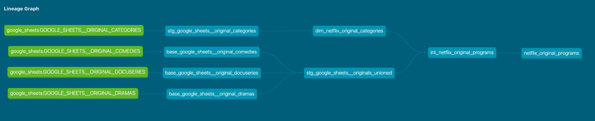

### Netflix Original Programming (in progress)

Data Pipeline (ELT) project using the Modern Data Stack (MDS) to Extract/Load (Airbyte) netflix data into my data warehouse (Snowflake) then transform (dbt) and model that data in order to visualize it in a Dashboard (tbd). 

The source data originates from tables in a <a href="https://en.wikipedia.org/wiki/List_of_Netflix_original_programming" target="_blank">Netflix Wikipedia Page</a> that interestingly, updates daily. From there, I'm pulling each table from the wikipedia site into Google Sheets using the importhtml() function and having them refresh daily. I'm using Airbyte to ingest the raw data into snowflake where it is then staged, transformed, and modeled using dbt. The focus of this project is on gaining experience on setting up fully orchestrated data pipelines and so the scope of the project/data was intentionally kept minimal.

**Project Objective:** Setup a fully automated data pipeline with reporting tables that drive my Dashboard containing an overview of current Netflix original programs and the ones launching in upcoming days/weeks/months (this way my wife and i can see what’s coming down the pipeline)

**MDS Tools Used in Project:**
- Snowflake (datawarehousing)
- Airbyte (data ingestion)
- dbt Core (data transformation + data modeling)
- Prefect (automated orchestration)
- Thoughtspot/Looker/Tableau (data visualization) - TBD

**Link to Dashboard (refreshed daily):** Coming Soon =)

**Project Dag (in progress):**
